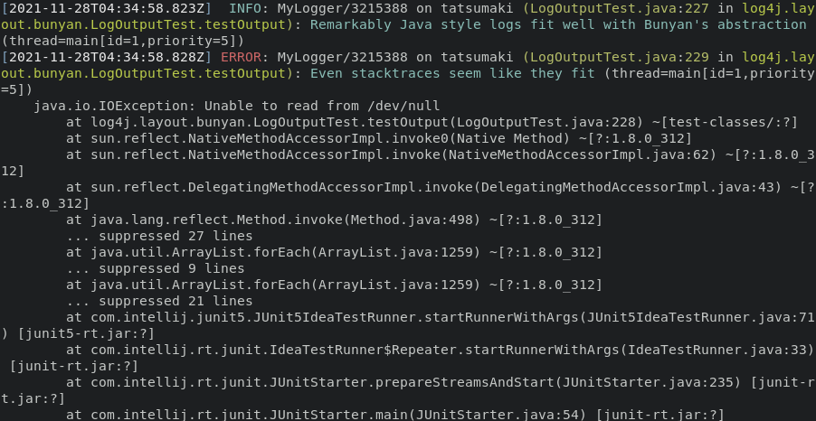

# Log4j2 Bunyan Layout
[](https://github.com/dekobon/log4j2-bunyan-layout/actions/workflows/ci.yaml)



## Overview

This project provides a custom [Log4j Layout](https://logging.apache.org/log4j/2.x/manual/layouts.html)
that outputs structured logs in the [Bunyan JSON](https://github.com/trentm/node-bunyan)
format. Similar to Log4j `log4j2-bunyan-layout` aims to 
[minimize object creation and thereby garbage collection](https://logging.apache.org/log4j/2.x/manual/garbagefree.html). Additionally, `log4j2-bunyan-layout` uses the
[DSL-JSON library](https://github.com/ngs-doo/dsl-json) for fast JSON
serialization.

## Configuration

Add a dependency definition to your Maven pom.xml:
```xml
<project>
    ...
    <dependencies>
        <dependency>
            <groupId>org.apache.logging.log4j</groupId>
            <artifactId>log4j-core</artifactId>
            <version>2.14.1</version>
            <scope>provided</scope>
        </dependency>
        <dependency>
            <groupId>com.github.dekobon</groupId>
            <artifactId>log4j2-bunyan-layout</artifactId>
            <version>1.0.0</version>
        </dependency>
    </dependencies>
</project>
```

Edit your log4j2 configuration such that you have added it as a layout to your
appender. For example, a minimal configuration would look like:
```xml
<?xml version="1.0" encoding="UTF-8"?>
<Configuration>
    <Appenders>
        <File name="MyFile" fileName="output.json">
            <BunyanJsonLayout />
        </File>
    </Appenders>
    <Loggers>
        <Root level="debug">
            <AppenderRef ref="MyFile"/>
        </Root>
    </Loggers>
</Configuration>
```

A more robust configuration may look like:

```xml
...
        <File name="MyFile" fileName="output.json">
            <BunyanJsonLayout endOfLine="\n" maxMessageLength="1000" properties="false">
                <ThrowableFormat format="extended" ignorePackages="org.junit"/>
                <KeyValuePair key="additionalField" value="constant value"/>
                <KeyValuePair key="traceId" value="$${ctx:trace_id:-}"/>
            </BunyanJsonLayout>
        </File>
...
```

The layout has the following properties.

### `BunyanJsonLayout`
 * `endOfLine` - string to append to the end of each JSON object (default: (Unix new line) `\n`).
   This property accepts Java style escaped values such as: `\n`, `\r`, `\t`, `\0`. 
   If there are octals, unicode, or any sort of non-trivial escapes in
   this value, Java 15+ must be used or the Apache Commons Text library must be
   loaded.
 * `maxMessageLength` - size in characters to truncate log messages to (default: `32768`).
 * `properties` - flag when set to true enables the output of *all* [context properties](https://logging.apache.org/log4j/2.x/manual/thread-context.html) (default: `false`).

### `ThrowableFormat` (Optional element - only a single element is valid)
 * `format` - pattern in which to format exception (throwable) stack traces that 
   are associated  with a log event. If `format` is specified `depth` may not be 
   specified. Format can be set to any of the following values:
   * `none` - no stacktrace is output.
   * `full` - the full stacktrace is output (default).
   * `extended` - outputs the full stacktrace including the location of where 
      the class was loaded from and the version of the jar if available.
   * `short` - outputs the first line of the Throwable.
   * `short.className` - outputs the name of the class where the exception occurred.
   * `short.methodName` - outputs the method name where the exception occurred.
   * `short.lineNumber` - outputs the line number where the exception occurred.
   * `short.fileName` - outputs the name of the file where the exception occurred.
   * `short.message` - outputs only the message.
   * `short.localizedMessage` - outputs the localized message.
 * `depth` - number of lines of the stack trace to output. If `depth` is 
   specified `format` may not be specified.
 * `ignorePackages` - a comma delimited list of Java packages to suppress 
   matching stack frames from stack traces. 

### `KeyValuePair` (Optional element - many elements may be defined) 
 * `key` - String indicating the name of the value to be output as an additional
   log attribute.
 * `value` - A string constant to output as an additional log attribute, or
   alternatively a dynamic value defined using 
   [Log4j2's lookup syntax](https://logging.apache.org/log4j/2.x/manual/lookups.html).

## License

This project is licensed under the [Apache License v2 license](./LICENSE).
